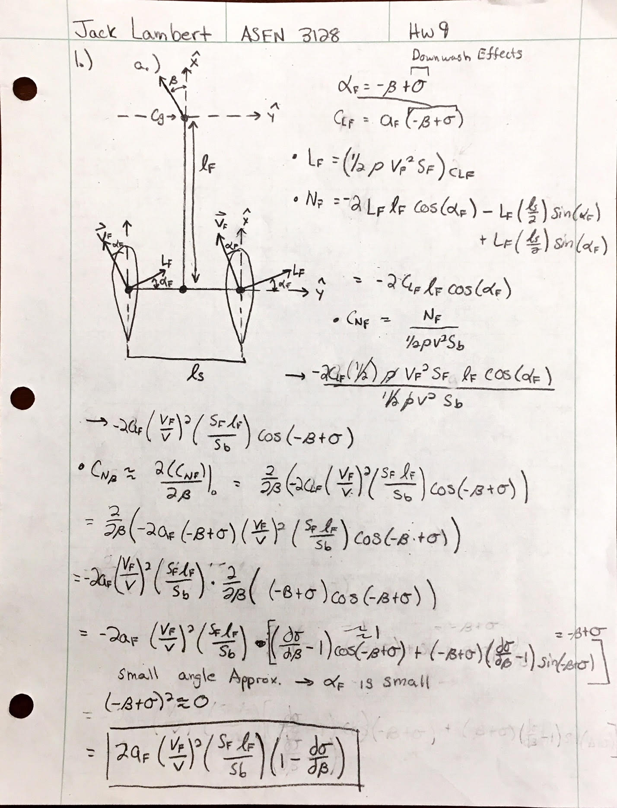
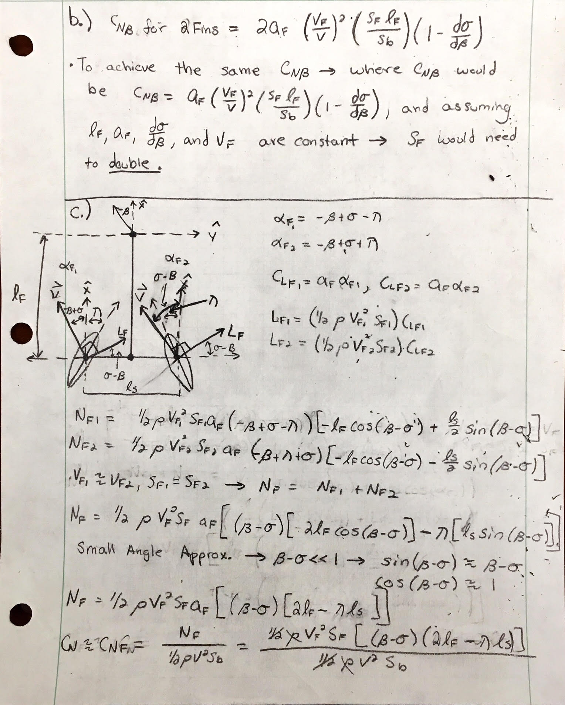
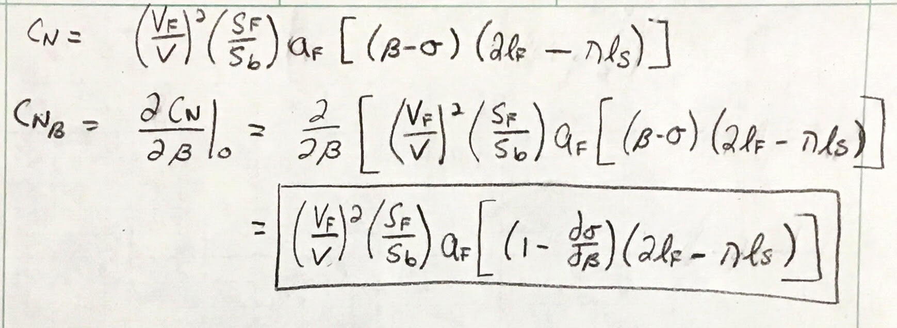
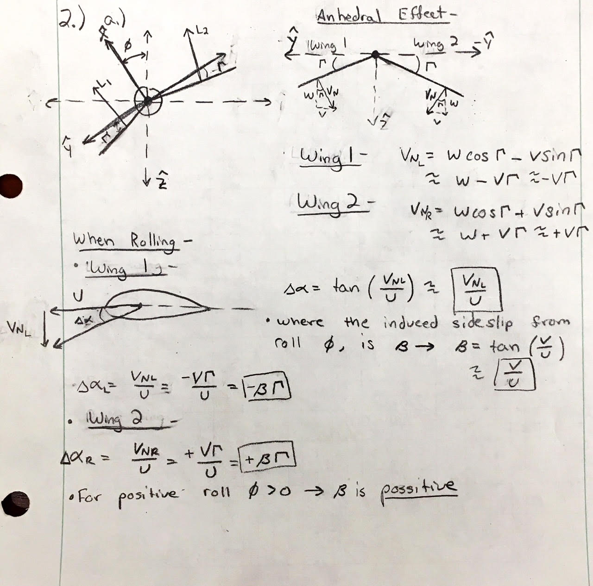
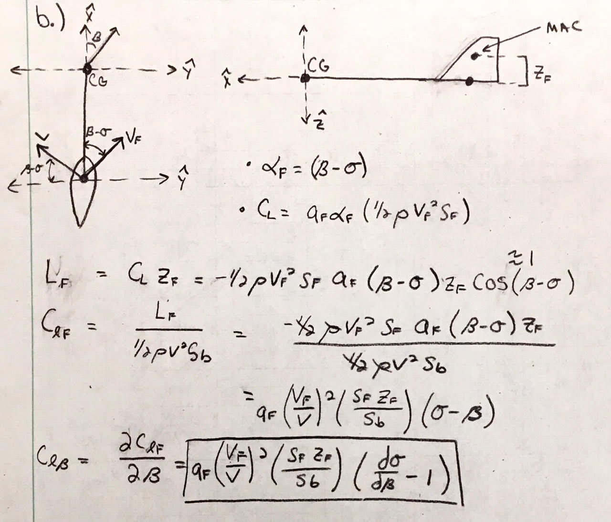
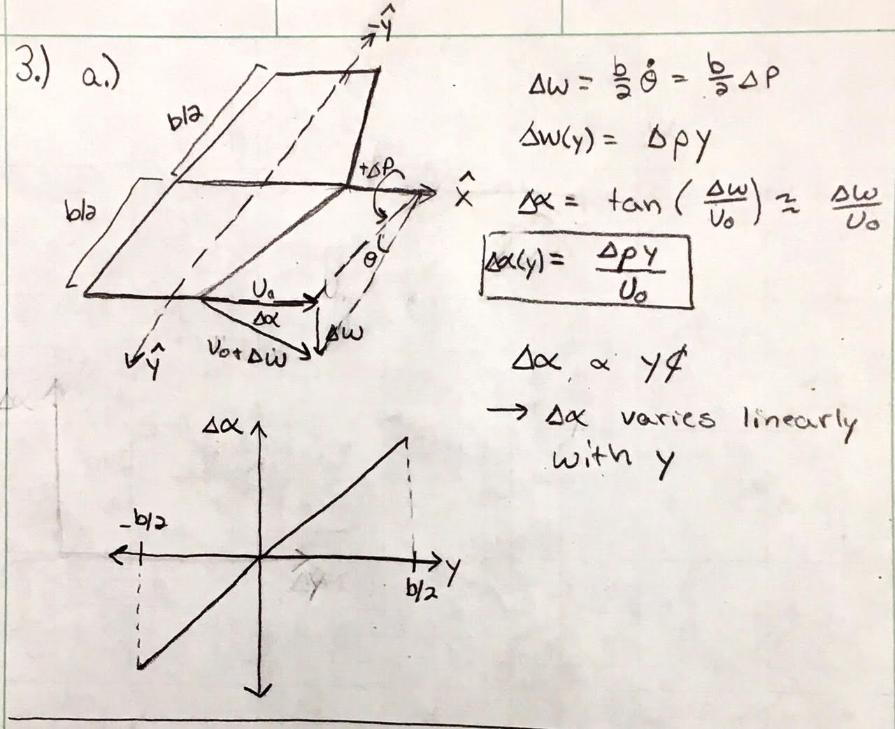
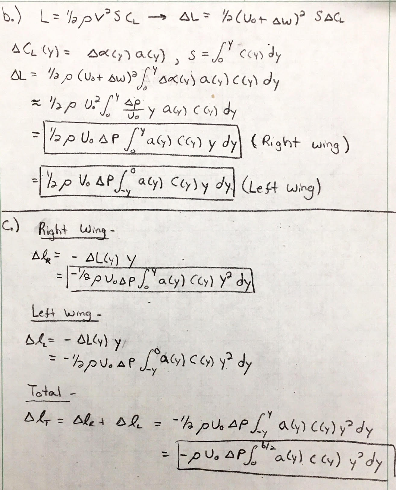
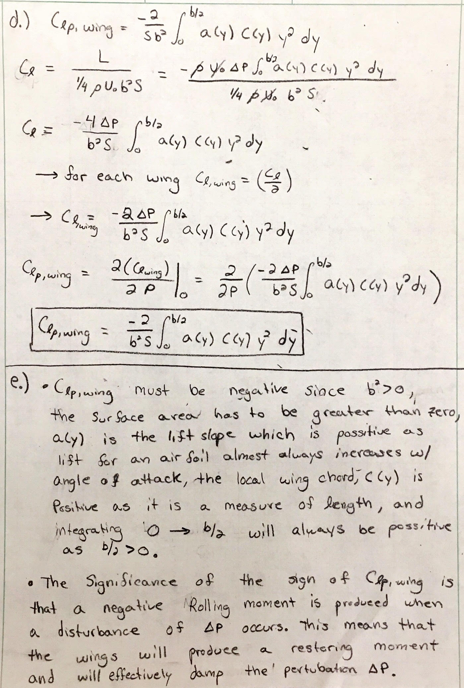
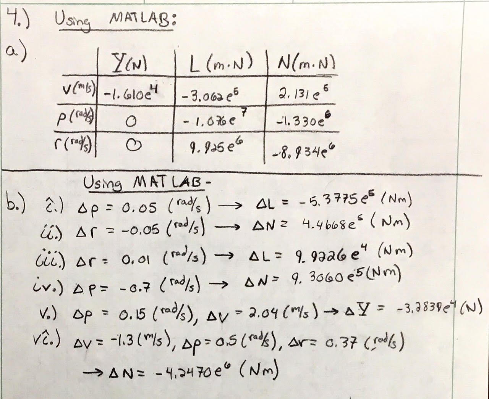

# ASEN 3128 Homework 9

## Question 1 - Yaw Stiffness Lateral Derivative ( $C_{n\beta}$ ):

**Question 1, Part a:**  

 

### **Part a.)**
When deriving an expression for the yaw stiffness lateral derivative, $C_{n\beta}$, for a twin fin airplane, it was noticed that $C_{n\beta}$ had no dependence on the distance between the fins, ls. This is due to the offsetting moments they create due to the symmetry about the x-axis. Since both fins contribute the same lift component about the x-body direction, but with opposite signs, the moment must offset as the moment arm distance for both are $\frac{ls}{2}$.  

**Question 1, Part b/c:**  

 

### **Part b.)**

To achieve the same yaw stiffness with a single fin, it intuitively makes sense that the surface area of the tail would need to double. Since the twin fin design has offsetting moments, acting from forces in the x-body direction, the only different in moment for a twin fin design to a single fin design would be from the magnitude of the moment from forces about the y-body direction. Since there are two fins, the area of a single fin must be double that of each fin in the double fin design. While side-wash effects would surely be different, the assumption that it is the same mathematically shows that the area of a single fin would need to be double.  

**Question 1, Part c:**  

 

### **Part c.)**

When the twin fin design incorporates an offset angle on each of the wings, $\eta$, defined so that the angle is positive when the tails are angled inward, the results from figure 3 were found. These results make intuitive sense since the yaw stiffness would decrease as the $\eta$ was made larger. Since the resulting lift would have the same direction due to the relative wind vector would not change, the only effect having the fins on an angle would have would be an effect on the magnitude of the lift from each of the fins. The larger the angle $\eta$, the larger the lift on the left wing and the smaller the lift on the right wing. This creates a none restoring moment since the deviation is about negative $\beta$, therefore needs a negative moment to restore back to equilibrium, however, the moment is positive from the larger lift induced on the left wing (and smaller on the right).  

## Question 2 - Roll Stiffness Lateral Derivative ($C_{l\beta}$):

**Question 2, Part a:**  

 

To see the effect an anhedral wing has on roll stiffness, we first had to analyze what the anhedral angle, $\Gamma$, with relation to to its components when in roll. The velocity normal to the wing changes as the airplane rolls. This normal contribution of the velocity is also dependent on the wings anhedral angle. Using the relations for changes in angle of attack, it was found that increasing the anhedral angle, which is already defined as negative in the figures above, decreases the angle of attack on wing 1 and increases the angle of attack on wing 2. This has the effect of decreasing the lift on wing 1 and increasing the lift on wing 2. Since the airplane is rolling in a positive direction, the contributions of the lift from the anhedral angle will cause a non-restoring moment and thus must be contributing a positive component to $C_{l\beta}$.  

**Question 2, Part b:**  

 

Since the vertical fin has a mean aerodynamic chord that lies a distance $z_F$ above the x-axis of the body, it then in turn must contribute a moment about the x-axis as the lift has tangential components to that of the x-axis of the body. This is illustrated above and the contribution of roll stiffness with respect to the tail for changing $\beta$ is calculated assuming small angle disturbances.  

## Question 3 - Damping in Roll Lateral Derivative ($C_{l_p}$)

**Question 3, Part b:**  

 

**Question 3, Part b/c:**  

 

**Question 3, Part d/e:**   

 

## Question 4 - Dimensional Lateral Derivatives:

**Question 4:**  

 
